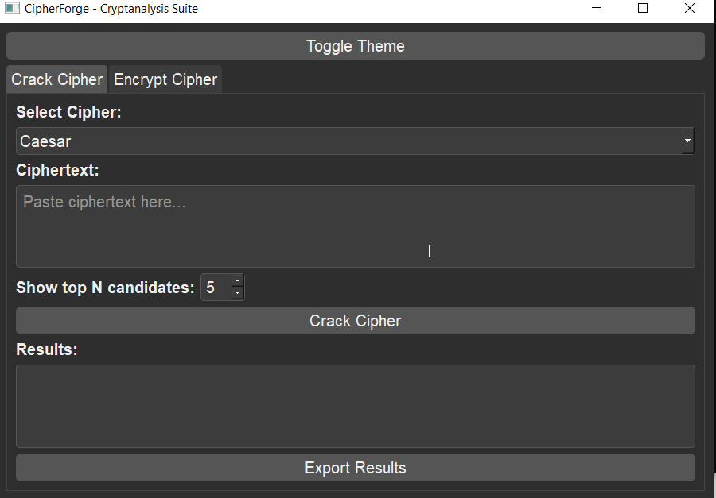
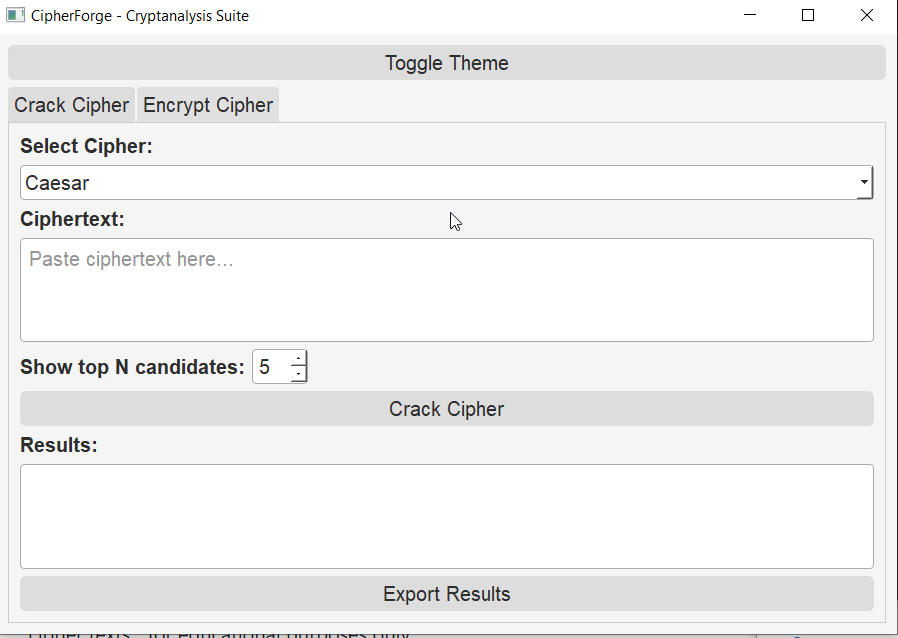
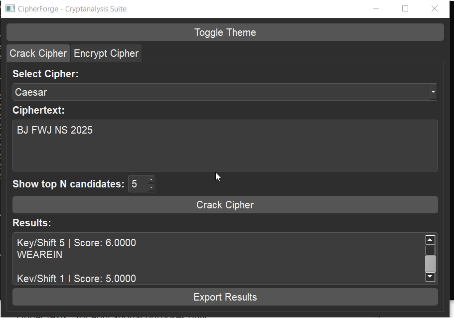

# CipherForge
This Repo brings a cryptographic , friendly but dangerous tool to your hand, mainly for encrypting and decrypting cipher texts....for educational purposes only.

CipherForge is a Python-based cryptanalysis suite with a professional PyQt5 GUI. It allows users to encrypt, decrypt, and crack classical ciphers such as Caesar and Vigenère, with support for exporting results and theme customization.

 Features

 Crack Caesar and Vigenère ciphers

 Encrypt plaintext using Caesar & Vigenère

 Export cracked results or ciphertexts to .txt

 Toggle between Dark and Light themes

 Clean PyQt5 GUI for an intuitive experience

 Screenshots



 Installation

Clone the repository:
```bash
git clone https://github.com/Mikey-19/CipherForge.git
cd CipherForge
```

Install dependencies:
```bash
pip install PyQt5
```

Run the application:
```bash
python gui.py
```
 Usage
 
Crack a Cipher

Open the Crack Tab.

Select cipher type (Caesar / Vigenère).

Paste ciphertext and click Crack Cipher.

View candidate plaintexts with key/shift info.

Export results if needed.

Encrypt a Message

Open the Encrypt Tab.

Select cipher type (Caesar / Vigenère).

Enter plaintext and a key/shift.

Click Generate Ciphertext.

Export ciphertext if needed.

 Examples

Caesar Cipher
```
Plaintext: HELLO WORLD

Shift: 3

Ciphertext: KHOOR ZRUOG

Vigenère Cipher

Plaintext: HELLO WORLD

Key: KEY

Ciphertext: RIJVS UYVJN
```
 Tech Stack
```
Python 3.9+

PyQt5 (GUI)
```






 License

This project is for educational and research purposes only.

 Author

Developed by Michael Aryee as part of a cybersecurity internship project at Inlighn Tech.


